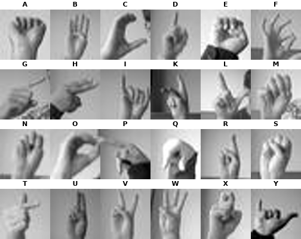
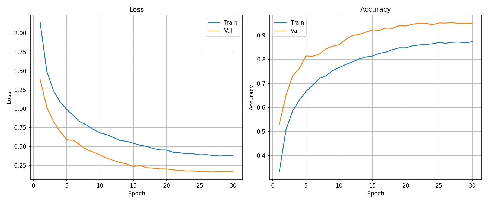
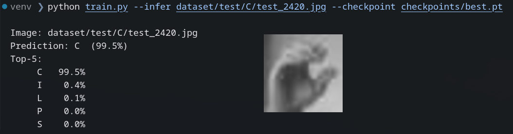

## Цель работы

Цель данной практической работы заключается в построении Feed-forward сети для решения задачи классификации изображений жестов американского жестового языка (ASL) с применением современных фреймворков.

---

## Содержание практической работы

### 1. Подготовка данных

В качестве обучающего набора данных был выбран датасет изображений [жестов американского жестового языка (ASL)](https://huggingface.co/datasets/rrrajjj/American-Sign-Language-MNIST), размещённый локально. Набор содержит 24 класса (буквы латинского алфавита за исключением J и Z) с изображениями размером 28×28 пикселей в градациях серого (Рисунок 1). Метаданные датасета хранятся в файле `samples.json`. Каждая запись содержит путь к изображению, тег разбиения (`train` / `test`) и метку класса в поле `ground_truth.label`.



Для приведения датасета к стандартному формату `ImageFolder` был разработан скрипт `prepare_dataset.py`. Скрипт читает `samples.json`, обходит все записи и копирует каждое изображение в директорию вида `dataset/{split}/{label}/`, где `split` — тег разбиения, а `label` — метка класса. Записи без тега пропускаются.

```
dataset/
├── train/
│   ├── A/
│   ├── B/
│   └── ...
└── test/
    ├── A/
    ├── B/
    └── ...
```

Запуск подготовки данных:

```bash
python prepare_dataset.py
```

---

### 2. Реализация приложения

Для реализации приложения были выбраны следующие технологии:

- **Язык программирования:** Python;
- **ML-библиотеки:** PyTorch, torchvision;
- **Библиотека визуализации:** Matplotlib.

Проект разбит на три модуля:

| Файл | Назначение |
|---|---|
| `config.py` | Гиперпараметры и пути |
| `model.py` | Архитектура MLP |
| `train.py` | Загрузка данных, цикл обучения, вывод |

#### 2.1 Конфигурация

Ключевые параметры обучения задаются в `config.py`:

```python
DATA_ROOT  = Path("dataset")
CKPT_DIR   = Path("checkpoints")
IMG_SIZE   = 28          # размер изображения (пикселей)
BATCH_SIZE = 64          # размер батча
EPOCHS     = 30          # число эпох
LR         = 1e-3        # скорость обучения
HIDDEN     = [512, 256]  # размеры скрытых слоёв
DEVICE     = "cuda" if torch.cuda.is_available() else "cpu"
```

#### 2.2 Архитектура модели

Реализован многослойный персептрон (MLP) с конфигурируемым числом скрытых слоёв. Каждый скрытый блок включает полносвязный слой, батч-нормализацию, активацию ReLU и Dropout для регуляризации.

```python
class MLP(nn.Module):
    def __init__(self, in_features, hidden_sizes, num_classes):
        super().__init__()
        layers = []
        prev = in_features
        for h in hidden_sizes:
            layers += [
                nn.Linear(prev, h),
                nn.BatchNorm1d(h),
                nn.ReLU(),
                nn.Dropout(0.3),
            ]
            prev = h
        layers.append(nn.Linear(prev, num_classes))
        self.net = nn.Sequential(*layers)

    def forward(self, x):
        return self.net(x.view(x.size(0), -1))
```

При конфигурации `HIDDEN = [512, 256]` входной вектор размерности 784 (28×28) преобразуется по схеме: **784 → 512 → 256 → 24**.

#### 2.3 Загрузка и аугментация данных

Данные загружаются через стандартный `torchvision.datasets.ImageFolder`. Для тренировочной выборки применяется аугментация: случайное горизонтальное отражение и аффинные преобразования (поворот ±10°, сдвиг 10%).

```python
def get_transforms(train: bool) -> transforms.Compose:
    t = [
        transforms.Grayscale(),
        transforms.ToTensor(),
        transforms.Normalize(mean=[0.5], std=[0.5]),
    ]
    if train:
        t = [
            transforms.RandomHorizontalFlip(),
            transforms.RandomAffine(degrees=10, translate=(0.1, 0.1)),
        ] + t
    return transforms.Compose(t)
```

#### 2.4 Цикл обучения

В качестве функции потерь используется кросс-энтропия, оптимизатор — AdamW с L2-регуляризацией (`weight_decay=1e-4`), планировщик скорости обучения — косинусное затухание.

```python
criterion = nn.CrossEntropyLoss()
optimizer = torch.optim.AdamW(model.parameters(), lr=LR, weight_decay=1e-4)
scheduler = torch.optim.lr_scheduler.CosineAnnealingLR(optimizer, T_max=EPOCHS)
```

На каждой эпохе модель обучается на тренировочной выборке, после чего оценивается на тестовой. Отслеживаются потери (Loss) и точность (Accuracy) на обоих разбиениях. Лучший чекпоинт по метрике на тестовой выборке сохраняется в `checkpoints/best.pt`.

```
Epoch   1/30 | train loss 1.8432 acc 0.4821 | val loss 1.5241 acc 0.5630
Epoch   2/30 | train loss 1.2104 acc 0.6317 | val loss 1.1832 acc 0.6741  ← best
...
```

Запуск обучения:

```bash
python train.py
```

---

### 3. Результаты обучения

По завершении обучения автоматически строятся графики динамики потерь и точности на тренировочной и тестовой выборках (Рисунок 2) и сохраняются в `checkpoints/training_curves.png`.



---

### 4. Тестирование модели

После обучения модель можно применить к произвольному изображению с помощью режима инференса (Рисунок 3):

```bash
python train.py --infer path/to/image.jpg --checkpoint checkpoints/best.pt
```

Вывод содержит предсказанный класс и топ-5 вероятностей:

```
Image: path/to/image.jpg
Prediction: B  (94.3%)
Top-5:
     B  94.3%
     D   3.1%
     A   1.4%
     F   0.7%
     G   0.3%
```



---

## Вывод

Таким образом, в ходе выполнения практической работы был реализован конвейер классификации жестов американского жестового языка: подготовка данных для соответствия стандартному `ImageFolder`, обучение многослойного персептрона с батч-нормализацией и Dropout-регуляризацией, а также инференс на отдельных изображениях. Разработанный код разбит на независимые модули (`config.py`, `model.py`, `train.py`), что облегчает его сопровождение и модификацию гиперпараметров.
